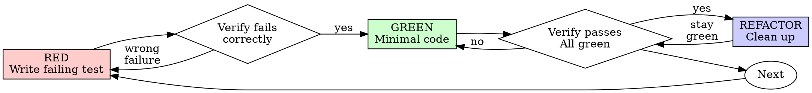

# Claude Code Conversation

| Property | Value |
|----------|-------|
| **Session ID** | 78e5c085-66be-4724-899e-bfac7319c580 |
| **Repository** | C:\Users\bbenfraj\projects\iftar-ramadhan |
| **Created** | 2026-10-01 14:39:06 |
| **Messages** | 2 |
| **Model** | claude-opus-5-5 |
| **Tool** | Claude Code |

---

## Message 1

**Time:** 2026-10-01 14:39:06

### User

```
In the iftar-ramadhan monorepo, the NestJS backend endpoint `createFasting` in `apps/backend/src/fasting/controllers/fasting.controller.ts` (around lines 230-245) handles `input.cameToday`. When `cameToday === true`, it sets `lastTakenMeal` and `takenMeals` to today, which is correct. When it's false, it subtracts one day and sets `input.lastTakenMeal = yesterday` and `input.takenMeals = [yesterday]`. That records a meal the person never took: it shows up in their meal history and inflates yesterday's statistics.

Fix it so that a newly registered person who didn't come today has no taken meals (`takenMeals = []`, and `lastTakenMeal` null). Check the entity `apps/backend/src/fasting/entities/fasting.entity.ts`: `lastTakenMeal` is a non-nullable `@Column({ name: 'lastTakenMeal' })`. If null isn't allowed, decide whether a migration to make it nullable is needed (migrations live in `apps/backend/migrations/`). Also check `apps/backend/src/fasting/services/fasting.service.ts`, which reads `lastTakenMeal` in the confirm logic and the statistics query, so that null works everywhere. Check the Flutter client too (`apps/mobile/lib/features/people/domain/fasting_person.dart` already treats `lastTakenMeal` as nullable).

Add or update unit tests for both `cameToday` cases. Note that Flutter has no SDK on the host and runs via Docker. Node 24, latest NestJS. Don't commit; leave changes for review.
```

---

## Message 2

**Time:** 2026-10-01 14:39:16

### User

```
Base directory for this skill: C:\Users\bbenfraj\.claude\plugins\cache\claude-plugins-official\superpowers\6.4.1\skills\test-driven-development

# Test-Driven Development (TDD)

## Overview

Write the test first. Watch it fail. Write minimal code to pass.

**Core principle:** If you didn't watch the test fail, you don't know if it tests the right thing.

**Violating the letter of the rules is violating the spirit of the rules.**

## When to Use

**Always:**
- New features
- Bug fixes
- Refactoring
- Behavior changes

**Exceptions (ask your human partner):**
- Throwaway prototypes
- Generated code
- Configuration files

Thinking "skip TDD just this once"? Stop. That's rationalization.

## The Iron Law

```
NO PRODUCTION CODE WITHOUT A FAILING TEST FIRST
```

Write code before the test? Delete it. Start over.

**No exceptions:**
- Don't keep it as "reference"
- Don't "adapt" it while writing tests
- Don't look at it
- Delete means delete

Implement fresh from tests. Period.

## Red-Green-Refactor



### RED - Write Failing Test

Write one minimal test showing what should happen.

<Good>
```typescript
test('retries failed operations 3 times', async () => {
  let attempts = 0;
  const operation = () => {
    attempts++;
    if (attempts < 3) throw new Error('fail');
    return 'success';
  };

  const result = await retryOperation(operation);

  expect(result).toBe('success');
  expect(attempts).toBe(3);
});
```
Clear name, tests real behavior, one thing
</Good>

<Bad>
```typescript
test('retry works', async () => {
  const mock = jest.fn()
    .mockRejectedValueOnce(new Error())
    .mockRejectedValueOnce(new Error())
    .mockResolvedValueOnce('success');
  await retryOperation(mock);
  expect(mock).toHaveBeenCalledTimes(3);
});
```
Vague name, tests mock not code
</Bad>

**Requirements:**
- One behavior
- Clear name
- Real code (no mocks unless unavoidable)

### Verify RED - Watch It Fail

**MANDATORY. Never skip.**

```bash
npm test path/to/test.test.ts
```

Confirm:
- Test fails (not errors)
- Failure message is expected
- Fails because feature missing (not typos)

**Test passes?** You're testing existing behavior. Fix test.

**Test errors?** Fix error, re-run until it fails correctly.

### GREEN - Minimal Code

Write simplest code to pass the test.

<Good>
```typescript
async function retryOperation<T>(fn: () => Promise<T>): Promise<T> {
  for (let i = 0; i < 3; i++) {
    try {
      return await fn();
    } catch (e) {
      if (i === 2) throw e;
    }
  }
  throw new Error('unreachable');
}
```
Just enough to pass
</Good>

<Bad>
```typescript
async function retryOperation<T>(
  fn: () => Promise<T>,
  options?: {
    maxRetries?: number;
    backoff?: 'linear' | 'exponential';
    onRetry?: (attempt: number) => void;
  }
): Promise<T> {
  // YAGNI
}
```
Over-engineered
</Bad>

Don't add features, refactor other code, or "improve" beyond the test.

### Verify GREEN - Watch It Pass

**MANDATORY.**

```bash
npm test path/to/test.test.ts
```

Confirm:
- Test passes
- Other tests still pass
- Output pristine (no errors, warnings)

**Test fails?** Fix code, not test.

**Other tests fail?** Fix now.

**"Other tests" means the project's suite, not just your file.** A
green run of the test you wrote is not a green suite. Before you call
the change done, run the project's test command (bare `pytest`,
`npm test`, `cargo test` — whatever the repo uses) even when your task
named only one test file. A scope statement in your task bounds the
deliverable, not your verification. Any failure that run shows —
including one you didn't cause — goes in your report by name; a red
test you watched scroll past and didn't mention is a report falsified
by omission.

### REFACTOR - Clean Up

After green only:
- Remove duplication
- Improve names
- Extract helpers

Keep tests green. Don't add behavior.

### Repeat

Next failing test for next feature.

## Good Tests

| Quality | Good | Bad |
|---------|------|-----|
| **Minimal** | One thing. "and" in name? Split it. | `test('validates email and domain and whitespace')` |
| **Clear** | Name describes behavior | `test('test1')` |
| **Shows intent** | Demonstrates desired API | Obscures what code should do |

When writing or changing any test, read [writing-good-tests.md](writing-good-tests.md) for the rules that keep tests honest:
- Name the production change that would make the test fail — before writing it
- Assert on real behavior, never on mock behavior
- Keep test-only code in test utilities, out of production classes
- Understand a dependency's side effects before mocking it

## Common Rationalizations

| Excuse | Reality |
|--------|---------|
| "Too simple to test" | Simple code breaks. Test takes 30 seconds. |
| "I'll test after" | Tests written after pass immediately — which proves nothing. They may test the wrong thing, test the implementation instead of the behavior, or miss the edge case you forgot. You never watched it fail, so you never proved it can catch the bug. Test-first forces that failure. |
| "Tests after achieve same goals (spirit not ritual)" | Tests-after answer "what does this do?"; tests-first answer "what should this do?" Tests written after are biased by the code you already wrote — you verify the cases you remembered, not the ones you'd have discovered. Coverage without proof the tests work. |
| "Already manually tested" | Manual testing is ad-hoc: no record of what you covered, no way to re-run it when the code changes, easy to forget cases under pressure. "Worked when I tried it" ≠ comprehensive. Automated tests run the same way every time. |
| "Deleting X hours is wasteful" | Sunk cost fallacy — that time is already spent either way. The real choice: rewrite with TDD (high confidence) vs. keep it and bolt tests on after (low confidence, likely bugs). Keeping code you can't trust is the waste. |
| "Keep as reference, write tests first" | You'll adapt it. That's testing after. Delete means delete. |
| "Need to explore first" | Fine. Throw away exploration, start with TDD. |
| "Test hard = design unclear" | Listen to test. Hard to test = hard to use. |
| "TDD will slow me down" | TDD IS the pragmatic path: catches bugs before commit, prevents regressions, lets you refactor without fear. "Pragmatic" shortcuts mean debugging in production — slower, not faster. |
| "Manual test faster" | Manual doesn't prove edge cases. You'll re-test every change. |
| "Existing code has no tests" | You're improving it. Add tests for existing code. |

## Red Flags - STOP and Start Over

- Code before test
- Test after implementation
- Test passes immediately
- Can't explain why test failed
- Tests added "later"
- Rationalizing "just this once"
- "I already manually tested it"
- "Tests after achieve the same purpose"
- "It's about spirit not ritual"
- "Keep as reference" or "adapt existing code"
- "Already spent X hours, deleting is wasteful"
- "TDD is dogmatic, I'm being pragmatic"
- "This is different because..."

**All of these mean: Delete code. Start over with TDD.**

## Example: Bug Fix

**Bug:** Empty email accepted

**RED**
```typescript
test('rejects empty email', async () => {
  const result = await submitForm({ email: '' });
  expect(result.error).toBe('Email required');
});
```

**Verify RED**
```bash
$ npm test
FAIL: expected 'Email required', got undefined
```

**GREEN**
```typescript
function submitForm(data: FormData) {
  if (!data.email?.trim()) {
    return { error: 'Email required' };
  }
  // ...
}
```

**Verify GREEN**
```bash
$ npm test
PASS
```

**REFACTOR**
Extract validation for multiple fields if needed.

## Verification Checklist

Before marking work complete:

- [ ] Every new function/method has a test
- [ ] Watched each test fail before implementing
- [ ] Each test failed for expected reason (feature missing, not typo)
- [ ] Wrote minimal code to pass each test
- [ ] All tests pass
- [ ] Output pristine (no errors, warnings)
- [ ] Tests use real code (mocks only if unavoidable)
- [ ] Edge cases and errors covered

Can't check all boxes? You skipped TDD. Start over.

## When Stuck

| Problem | Solution |
|---------|----------|
| Don't know how to test | Write wished-for API. Write assertion first. Ask your human partner. |
| Test too complicated | Design too complicated. Simplify interface. |
| Must mock everything | Code too coupled. Use dependency injection. |
| Test setup huge | Extract helpers. Still complex? Simplify design. |

## Debugging Integration

Bug found? Write failing test reproducing it. Follow TDD cycle. Test proves fix and prevents regression.

Never fix bugs without a test.

## Final Rule

```
Production code → test exists and failed first
Otherwise → not TDD
```

No exceptions without your human partner's permission.
```

### Claude

Using TDD for this bug fix. Let me read the relevant code first.

Status: backend has no host `node_modules` (deps live in a Docker volume) and there's a running `iftar-test-db` Postgres container. Inspecting how to run tests.

Everything in the repo is staged, so my edits will show cleanly as unstaged changes. Checking e2e setup and docs before writing the failing test.

Now the RED step: a controller spec for both `cameToday` cases.

The project's `npm test` sets `--experimental-vm-modules`; using that instead.

RED confirmed: the "didn't come" cases fail because the code records yesterday (`2025-03-04T17:30`). Now the fix.

Now the migration (the DB column is `TIMESTAMP NOT NULL` per the initial schema, and `synchronize` is off in both configs, so a migration is required).

GREEN. Now regression tests in the service spec proving `null`/empty history works through create, confirm and statistics.

Now updating the e2e spec, which encoded the old "creation entry (yesterday)" behavior.

Running the full backend unit suite.

All 96 unit tests pass (16 suites). Next: e2e against the `iftar-test-db` container (it uses its own `e2e_test_db` database), plus lint and typecheck.

Prettier flags the service spec. Formatting it, then checking the diff touches only my additions.

Prettier only reflowed my added lines (+80/−0). Now the legacy Ionic null guard. I'll read the details page first.

Legacy app patched. Now the Flutter side: checking the domain tests and the details page's null handling.

All 42 Flutter tests pass (2 integration tests skipped since `IT_API_BASE_URL` isn't set) and the analyzer is clean. Quick targeted run to confirm the new test actually executed:

Last piece: docs. Checking where the backend changes and deploy steps are recorded.

The production container runs migrations from `dist/` on startup. Checking that the build compiles the `migrations/` folder:

The migration compiles into `dist/migrations`, and the production Dockerfile runs `migration:run` on startup, so it applies automatically on deploy. Adding a note to the migration report:

Final review of the full change set:

When someone is registered with "came today" unchecked, they now start with `takenMeals = []` and `lastTakenMeal = null` instead of a made-up meal dated yesterday. Backend unit (96/96), backend e2e on real Postgres 16 (8/8) and Flutter (42 passed, 2 integration tests skipped because they need a live API) all pass. Lint, typecheck and `flutter analyze` are clean. Nothing is committed: your staged tree is untouched and my changes are unstaged or untracked.

**Backend**
- **The fix:** [fasting.controller.ts](apps/backend/src/fasting/controllers/fasting.controller.ts:233). If `cameToday` is false or missing, nothing is recorded. If it's true, today is recorded as before.
- **Migration: yes, it's needed.** The initial schema created the column as `TIMESTAMP NOT NULL`, and `synchronize` is off. I added [1790850000000-MakeLastTakenMealNullable.ts](apps/backend/migrations/1790850000000-MakeLastTakenMealNullable.ts) and made the entity and output DTO nullable.
  - I ran up → down → up on a scratch database, since deleted. The down step fills nulls with `createdAt - 1 day` and doesn't touch the meal history.
  - The production Dockerfile already runs migrations on startup and the build compiles this one, so it applies on deploy without a manual step.
- **`fasting.service.ts`: no change needed.** The response mapping and the confirm logic already guard against a null `lastTakenMeal`, and statistics only read `takenMeals`. I added tests that prove this for create, first confirm and statistics.

**Tests**
- New [fasting.controller.spec.ts](apps/backend/src/fasting/controllers/fasting.controller.spec.ts) covers `cameToday` true, false, missing, and a client sending its own history. Before the fix, the false and missing cases failed with yesterday's date; they pass now.
- The e2e spec assumed every new person had a "yesterday" entry, so I updated it. I also added a "came today" case and a check that people registered today don't appear in yesterday's statistics.
- [domain_rules_test.dart](apps/mobile/test/domain/domain_rules_test.dart) gets a test for parsing a person with `null` / `[]`.

**Clients**
- **Flutter:** no code change. It already handles `null` everywhere: parsing, the details page, the export and the history sheet.
- **Legacy Ionic: this needed a fix.** Its `getDate(null)` falls back to *today*, so a person with `lastTakenMeal: null` showed as already served and the confirm button was hidden. I added a null check in [scan.page.ts](apps/legacy-ionic/src/app/pages/scan/scan.page.ts:111) and [person-details.page.ts](apps/legacy-ionic/src/app/pages/tab1/person-details/person-details.page.ts:56). I couldn't run its Karma tests here.

**Decisions for you**
- **Copies of the Ionic app already installed on phones** will still hide the confirm button for new no-show registrations. That lasts until the person's first meal is confirmed from a Flutter device. Rebuild the Ionic app, or move those volunteers to Flutter, before deploying the backend. I noted this in [MIGRATION_REPORT.md](docs/MIGRATION_REPORT.md).
- **Existing data is not cleaned up.** People already registered without coming still have the fake yesterday entry in their history. It can usually be spotted as the first entry, about 24h before `createdAt`. I can write a cleanup query if you want one.
- **Your local `iftar-test-api` database hasn't been migrated.** It has picked up the code change, so creating a person who didn't come today will fail there until you run the migration or restart the container:

```bash
MSYS_NO_PATHCONV=1 docker exec -w /app iftar-test-api npm run migration:run
```

---
